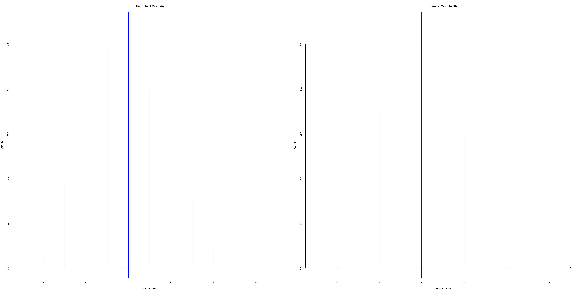
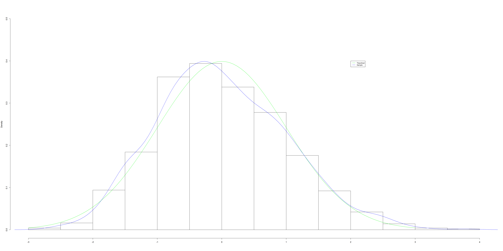

###StatisticalInference_PeerAssignment1  

##Overview:  

This course project report looks at a series of exponential distribution iterations, and compares the result set to a normal distribution and the theoretical mean and variance.  

This report is for a Coursera Class project - Statistical Inference (Part 1). Per the project requirements, the below solution maintains the following:  

Illustrate via simulation and associated explanatory text the properties of the distribution of the mean of 40 exponentials. You should:  
1. Show the sample mean and compare it to the theoretical mean of the distribution.  
2. Show how variable the sample is (via variance) and compare it to the theoretical variance of the distribution.  
3. Show that the distribution is approximately normal.  

###Simulations   
Simulating a thousand sets of 40 exponentials using lambda and calculate the mean for each set. Storing the data in a data frame to use it in furhter analysis.  


```r
library(knitr)
knitr::opts_chunk$set(fig.width=40, fig.height=20, fig.path='figs/', warning=FALSE, message=FALSE)
```


```r
#setting working directory
setwd("C:/Data/devtools/Git/StatsInfer_PeerAssessment1")
set.seed(1000)


lambda <- 0.2       
nex    <- 40   
sims   <- 1000 

#data frame with sumulated data
dfrm <- NULL
dfrm <- data.frame(mean=numeric(sims))
# Getting the mean of simulated data
for (i in 1:sims) {
        explmda   <- rexp(nex, lambda) 
        dfrm[i,1] <- mean(explmda) 
}
```

###Calculating Mean  

Calculating the mean for Theoretical and actula distributions. Using R function to calculate the Theoretical Mean  


```r
#Theoritical mean
thmn <-1/lambda  
thmn
```

```
## [1] 5
```

```r
#Sample mean
smpmn <-mean(dfrm$mean) 
smpmn
```

```
## [1] 4.986963
```
Sample Mean of the distribution **``4.9869634``** and Theoretical Mean **``5``** are very close (i.e, **```5```**). We could observe the same (blue line at 5) in below histograms:  


```r
# ploting the sample & theoretical means
par(mfrow=c(1,2))
hist(dfrm$mean,probability=T,main='Theoretical Mean (5)',ylim=c(0,0.55),xlab='Sample Means')
abline(v=thmn,col='blue',lwd=5)
hist(dfrm$mean,probability=T,main=paste('Sample Mean (4.98)'),ylim=c(0,0.55),xlab='Sample Means')
abline(v=smpmn,col='blue',lwd=5)
```

 

###Calculating Variance    

Calculating the Variance for Theoretical and actula distributions. Using R function to calculate the Theoretical Variance  

```r
thvar <-((1/lambda)^2)/nex #theoretical variance
thvar
```

```
## [1] 0.625
```

```r
smvar <- var(dfrm$mean)  #sample variance 
smvar
```

```
## [1] 0.654343
```
Sample Variance of the distribution **``0.65``** and Theoretical Variance **``0.62``** are very close  

##Distribution     
Plotted below theoritical mean and sample mean curves on a histogram. Both are close and normally distributed. So the the histogram for the mean of 1000 simulated 40 random exponential values are symmetric around the mean with a bell shape   

```r
par(mfrow=c(1,1))
hist(scale(dfrm$mean),probability=T,main='',ylim=c(0,0.5),xlab='')
curve(dnorm(x,0,1),-3,3, col='green',add=T)
lines(density(scale(dfrm$mean)),col='blue')
legend(2,0.4,c('Theoritical','Sample'),cex=0.8,col=c('green','blue'),lty=1)
```

 

When compare the Theoritical Variance and Sample Variance (Actual Variance), they are very close. So the  data similary distributed. This is wat expected from this analysis.  


