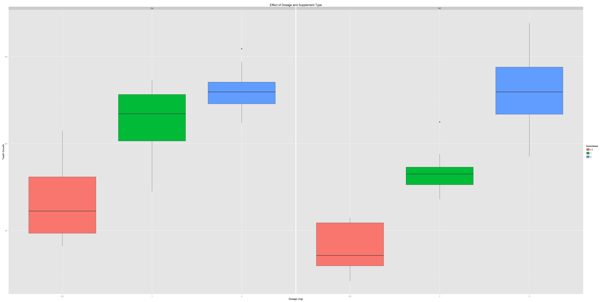

###StatisticalInference_PeerAssignment1b  

##Overview  

We're going to analyze the ToothGrowth data in the R datasets package.   
1. Load the ToothGrowth data and perform some basic exploratory data analyses  
2. Provide a basic summary of the data.  
3. Use confidence intervals and/or hypothesis tests to compare tooth growth by supp and dose. (Only use the techniques from class, even if there's other approaches worth considering)  
4. State your conclusions and the assumptions needed for your conclusions.   

Some criteria that you will be evaluated on  
. Did you  perform an exploratory data analysis of at least a single plot or table highlighting basic features of the data?  
. Did the student perform some relevant confidence intervals and/or tests?  
. Were the results of the tests and/or intervals interpreted in the context of the problem correctly?   
. Did the student describe the assumptions needed for their conclusions?  

###1. Load the ToothGrowth data and perform some basic exploratory data analyses   

Loading Tooth Growth data for analysis  


```r
#setting working directory
setwd("C:/Data/devtools/Git/StatsInfer_PeerAssessment1")
#loading datasets & packages
library(datasets)
library(ggplot2)

#loading data
data(ToothGrowth)
#getting data to a variable
tdata <- ToothGrowth
```


```r
library(knitr)
knitr::opts_chunk$set(fig.width=40, fig.height=20, fig.path='figs/', warning=FALSE, message=FALSE)
```


```r
dim(tdata)
```

```
## [1] 60  3
```

```r
#tooth data
head(tdata)
```

```
##    len supp dose
## 1  4.2   VC  0.5
## 2 11.5   VC  0.5
## 3  7.3   VC  0.5
## 4  5.8   VC  0.5
## 5  6.4   VC  0.5
## 6 10.0   VC  0.5
```

```r
#data stats (rows and columns)
str(tdata)
```

```
## 'data.frame':	60 obs. of  3 variables:
##  $ len : num  4.2 11.5 7.3 5.8 6.4 10 11.2 11.2 5.2 7 ...
##  $ supp: Factor w/ 2 levels "OJ","VC": 2 2 2 2 2 2 2 2 2 2 ...
##  $ dose: num  0.5 0.5 0.5 0.5 0.5 0.5 0.5 0.5 0.5 0.5 ...
```

###2. Provide a basic summary of the data   
Tabulating results  
Calculating Mean and Standard deviation for the data  


```r
tdata$dose <- as.factor(tdata$dose)
table(tdata$supp, tdata$dose)
```

```
##     
##      0.5  1  2
##   OJ  10 10 10
##   VC  10 10 10
```

```r
mean(tdata$len)
```

```
## [1] 18.81333
```

```r
sd(tdata$len)
```

```
## [1] 7.649315
```


```r
plot <- ggplot(ToothGrowth, 
               aes(x=factor(dose),y=len,fill=factor(dose)))
plot + geom_boxplot(notch=F) + facet_grid(.~supp) +
     scale_x_discrete("Dosage (mg)") +   
     scale_y_continuous("Teeth Growth") +  
     ggtitle("Effect of Dosage and Supplement Type")
```

 

###3. Use confidence intervals and/or hypothesis tests to compare tooth growth by supp and dose. (Only use the techniques from class, even if there's other approaches worth considering)  


```r
supp.t1 <- t.test(len~supp, paired=F, var.equal=T, data=tdata)
supp.t2 <- t.test(len~supp, paired=F, var.equal=F, data=tdata)
supp.result <- data.frame("p-value"=c(supp.t1$p.value, supp.t2$p.value),
                          "Conf-Low"=c(supp.t1$conf[1],supp.t2$conf[1]),
                          "Conf-High"=c(supp.t1$conf[2],supp.t2$conf[2]),
                          row.names=c("Equal Var","Unequal Var"))
supp.result
```

```
##                p.value   Conf.Low Conf.High
## Equal Var   0.06039337 -0.1670064  7.567006
## Unequal Var 0.06063451 -0.1710156  7.571016
```

###4. State your conclusions and the assumptions needed for your conclusions  

Based on the data anasysis, lower dosages(0.5 - 1.0 mg) and orange juice provides more tooth growth than ascorbic acid. The higher dosage (2mg), the rate of tooth growth is not statistically different between supplement methods. Regardless of the supplement method, dosage is a key factor in tooth growth.  


